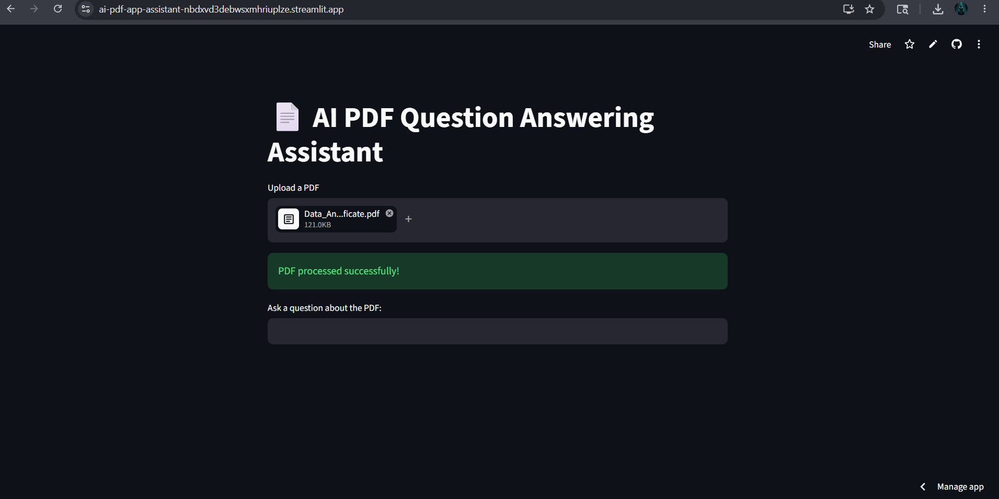
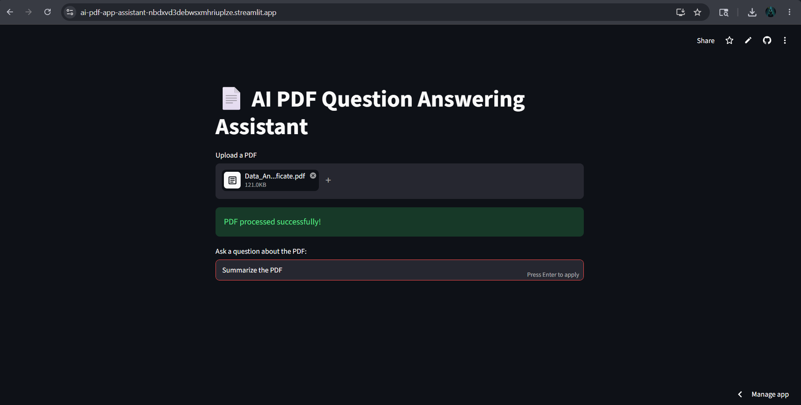
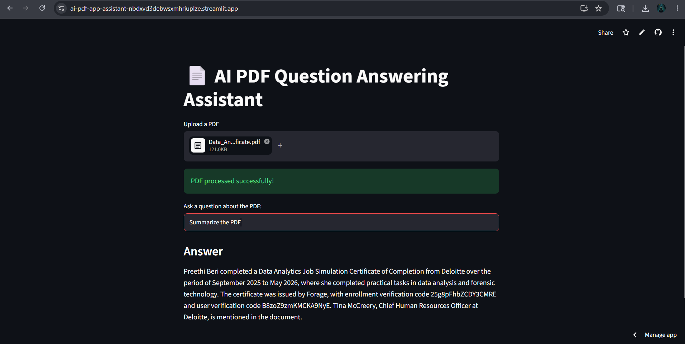

# 🤖 AI PDF Question Answering Assistant

An AI-powered Retrieval-Augmented Generation (RAG) application that allows users to upload PDF documents and ask intelligent questions about their content. The system retrieves relevant information from uploaded documents and generates accurate contextual responses using Large Language Models (LLMs).


---

## 📌 Project Overview

The AI PDF Question Answering Assistant is a Generative AI application built using Retrieval-Augmented Generation (RAG).

Users can upload PDF documents and ask questions in natural language. The application extracts document content, creates embeddings, stores them in a FAISS vector database, retrieves the most relevant information, and generates context-aware answers using Large Language Models.

This project demonstrates practical implementation of:

- Retrieval-Augmented Generation (RAG)
- Semantic Search
- Vector Databases
- Embeddings
- Large Language Models (LLMs)
- Natural Language Processing (NLP)

---

# 🚀 Features

✅ Upload PDF Documents

✅ Extract Text from PDFs

✅ Intelligent Question Answering

✅ Semantic Search using Embeddings

✅ FAISS Vector Database Integration

✅ Context-Aware AI Responses

✅ Streamlit Web Interface

✅ Fast Document Retrieval

---

# 🏗️ System Architecture

```text
User Uploads PDF
        ↓
Text Extraction
        ↓
Text Chunking
        ↓
Embedding Generation
        ↓
FAISS Vector Database
        ↓
Semantic Retrieval
        ↓
LLM Processing
        ↓
Answer Generation
        ↓
Response Displayed to User
```

---

# 🛠️ Tech Stack

### Programming Language
- Python

### Frameworks & Libraries
- Streamlit
- LangChain
- FAISS
- Sentence Transformers
- PyPDF2

### AI Technologies
- Retrieval-Augmented Generation (RAG)
- Embeddings
- Semantic Search
- Large Language Models (LLMs)

### API
- OpenRouter API

---

# 💡 Key Highlights

- Implemented Retrieval-Augmented Generation (RAG) pipeline
- Used FAISS for semantic vector search
- Integrated LLM responses using OpenRouter API
- Developed interactive UI using Streamlit
- Enabled document-based question answering
- Improved information retrieval efficiency
- Reduced manual document searching effort

---

# 🧠 Skills Demonstrated

- Python Programming
- Machine Learning
- Generative AI
- Retrieval-Augmented Generation (RAG)
- LangChain
- FAISS
- Vector Databases
- Natural Language Processing (NLP)
- Prompt Engineering
- Semantic Search
- Streamlit Development
- API Integration

---

# 📷 Demo Screenshots

## 🏠 Home Page


---

## 📄 PDF Upload



---

## ❓ User Question



---

## 🤖 Generated Response



---

# ⚙️ Working Process

### Step 1: Upload PDF
The user uploads a PDF document through the Streamlit interface.

### Step 2: Text Extraction
Text content is extracted from the uploaded PDF.

### Step 3: Chunking
Large text is divided into smaller chunks for efficient processing.

### Step 4: Embedding Generation
Embeddings are generated using Sentence Transformers.

### Step 5: Vector Storage
Generated embeddings are stored in a FAISS vector database.

### Step 6: User Query
The user asks a question related to the uploaded document.

### Step 7: Semantic Search
FAISS retrieves the most relevant document chunks.

### Step 8: LLM Response Generation
Relevant chunks are passed to the LLM through OpenRouter API.

### Step 9: Answer Display
The generated answer is displayed in the Streamlit interface.

---

# 📂 Project Structure

```text
AI-PDF-QA-Assistant/
│
├── app.py
├── requirements.txt
├── README.md
├── screenshots/
│   ├── home-page.png
│   ├── pdf-upload.png
│   ├── user-question.png
│   └── generated-answer.png
│
├── vector_store/
└── data/
```

---

# 🔧 Installation

### Clone Repository

```bash
git clone https://github.com/preethi-beri/AI-PDF-QA-Assistant.git
```

### Move to Project Directory

```bash
cd AI-PDF-QA-Assistant
```

### Install Dependencies

```bash
pip install -r requirements.txt
```

### Run Application

```bash
streamlit run app.py
```

---

# 📋 Requirements

```text
Python 3.9+
Streamlit
LangChain
FAISS
Sentence Transformers
PyPDF2
OpenRouter API Key
```

---

# 🎯 Use Cases

- Research Paper Analysis
- Academic Document Search
- Resume Analysis
- Business Report Analysis
- Legal Document Search
- Knowledge Management Systems
- Educational Assistance

---

# 📈 Future Enhancements

- Multi-PDF Question Answering
- Chat History Support
- Voice-Based Queries
- OCR for Scanned PDFs
- Cloud Deployment
- User Authentication
- Citation Generation
- Multiple File Format Support

---

# 🏆 Learning Outcomes

Through this project, I gained practical experience in:

- Generative AI Development
- Retrieval-Augmented Generation (RAG)
- Vector Databases (FAISS)
- LangChain Framework
- LLM Integration
- Streamlit Application Development
- Semantic Search Systems
- End-to-End AI Project Development

---

# 👩‍💻 Author

## Preethi Beri

B.Tech Computer Science & Data Science Student

AI/ML Enthusiast | Data Science Learner | Automation Testing Enthusiast

🔗 LinkedIn: https://www.linkedin.com/in/preethi-beri

🔗 GitHub: https://github.com/preethi-beri

---

⭐ If you found this project useful, consider giving it a star.
